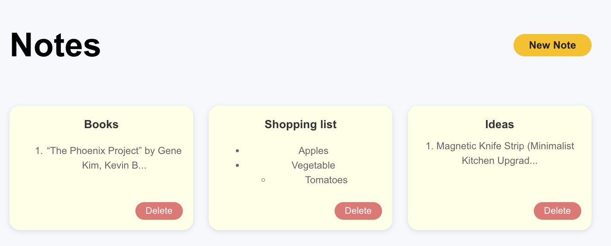
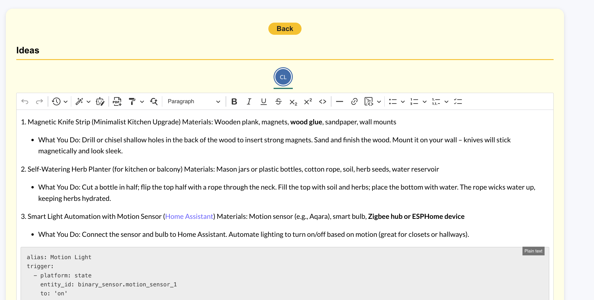

# Ondrej's notes


A simple note-taking application inspired by [Google Keep](https://keep.google.com/), built with React, TypeScript, and Vite.

> This repository works as a showcase of various development approaches.

## Features

- Create, edit, and delete notes
- Responsive UI
- Fast development with Vite
- Type safety with TypeScript
- Hot Module Replacement (HMR)
- Linting with ESLint
- Notes are being stored in browser local storage




## Getting Started

### Prerequisites

- [Node.js](https://nodejs.org/) (v16 or higher)
- [npm](https://www.npmjs.com/) or [yarn](https://yarnpkg.com/)

### Installation

```bash
git clone https://github.com/your-username/google-keep-clone.git
cd google-keep-clone
npm install
# or
yarn install
```

### Running the App

```bash
npm run dev
# or
yarn dev
```

The app will be available at [http://localhost:5173](http://localhost:5173).

## Linting and Formatting

This project uses ESLint for code linting. To run lint checks:

```bash
npm run lint
# or
yarn lint
```

## Deployment

[](https://vercel.com/new/clone?repository-url=https%3A%2F%2Fgithub.com%2FSimply007%2Fondrejs-notes)

## License

This project is licensed under the MIT License.
